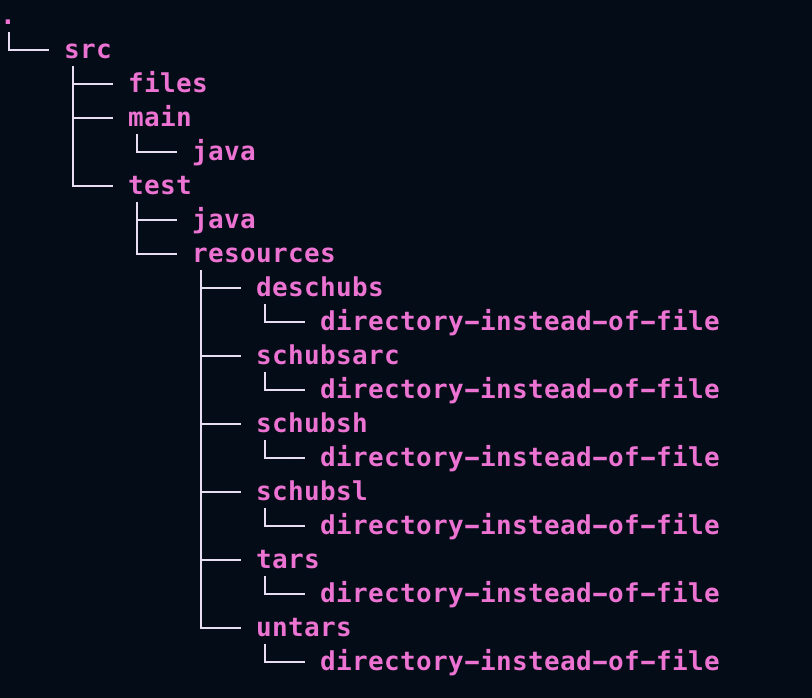

# SE2Final

## Design: Algorithm Theory and Trade Offs
### Huffman
Huffman encoding compresses data by assigning shorter codes to more frequent characters. It builds a binary tree where characters with higher frequencies have shorter codes. Input data is encoded using these codes, enabling efficient compression. During decoding, the same tree is used to translate the encoded data back into the original characters.
### LZW
LZW compression replaces repeated sequences of characters with codes, reducing data size. It builds a dictionary of encountered sequences, assigning unique codes. During decoding, it uses this dictionary to restore the original data.
### Tradeoffs
Huffman encoding often achieves superior compression ratios quickly, while LZW excels with repetitive data but is slower. Huffman needs less memory but lacks adaptability, unlike LZW, which dynamically updates its dictionary. Despite Huffman's simpler decoding, LZW's flexibility often makes it preferable, especially for diverse datasets.

## Installation: CLI Instructions
To use, the java files need to be compiled using mvn compile in the project's root directory, or the individual files need to be compiled individually using javac.
### Root Directory Image

## Test Instructions
Open project's root directory (as shown above), and run "mvn test"

## Run Examples: CLI Instructions
To run, run the java command and use -cp to reference where the project is stored on your machine.
For example. If you are a level up from your desktop (in user folder on a MAC), and the file is on your desktop, you could run by typing 
<mark>java -cp desktop/[projectName]/target/classes SchubsL | SchubsH | Deschubs | SchubsArc <args> </mark>